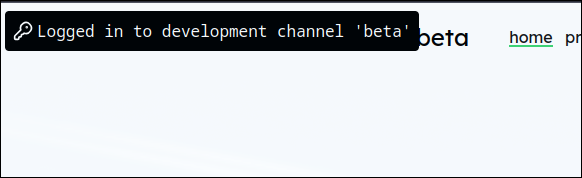

# Extending your project with more ray features

Congrats, you have now successfully deployed a ray project! To make the most of ray, explore some of the features listed below:

## Different deployments

One of ray's main features is being able to have different branches on your git repository accessible as different deployment channels. You can choose to automatically enroll a percentage of users into a channel, or have a development channel that requires authentication from someone with access to the ray server. See the example below:

```json
{
    "Projects": [
        {
            "Name" : "new-project",
            "Src" : "https://github.com/username/new-project-repo",
            "Domain" : "localhost",
            "Deployments": [
                {
                    "Branch": "cool-feature",
                    "Type": "test",
                    "Enrollment": 15
                },
                {
                    "Branch": "dev-branch",
                    "Type": "dev"
                }
            ]
        }
    ],
}
```

In this example, every new user on your site has a 15% chance of being enrolled into the _cool-feature_ channel, and the _dev-branch_ channel can only be accessed by authenticated users with access to the ray server.

## rayutil

rayutil is an optional feature of ray to have a small JS bundle be inserted alongside your page content (don't worry, it's not fetched remotely). Rayutil provides a few different methods and utilities for working with ray in the browser. To enable it, use the following key in your ray config:


```json
"EnableRayUtil": true
```


<figure><figcaption><p>Example of rayutil notification</p></figcaption></figure>
